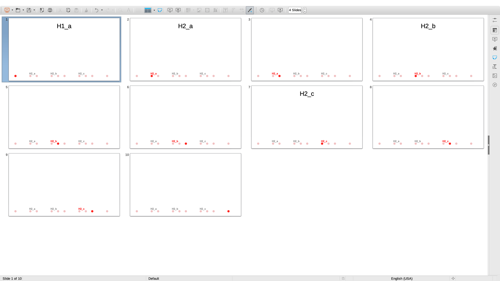

# impress-progress-line

Progress indicator for LibreOffice/OpenOffice Impress. A modification of https://github.com/dasaki/Impress-Progress-Bar .

Well, may be not so sophisticated. I had looked to start by forking that repository but end up, writing from scratch.

Current state, it is working (LibreOffice v6.0.2.1). However, Setting are not presented in GUI.

## Setup

1. Tools > Macros > Organize Macros > LibreOffice Basic...
1. My Macros > Standard: New module name it "ProgressLine" or whatever.
1. Select it then Edit, Copy contents of [src/ProgressLine.bas](src/ProgressLine.bas)
1. Save it

## Workflow

### Add ProgressLine

1. Create index, a text file, in same folder with same name but with `.index` extension, (double extension) example `test.odp.index`:

        5
        1,_
        2,H2_a
        4,H2_b
        7,H2_c
        10,_

   - First line is total number of section
   - Remaining lines in this format: page, section title
   - `_` special for section without title

1. Open your presentation
1. Tools > Macros > Organize Macros > LibreOffice Basic...: Run `ProgressLineAdd`

### Remove ProgressLine

- Tools > Macros > Organize Macros > LibreOffice Basic...: Run `ProgressLineRemove`

## Notes

- Most settings are grouped at the top of the script, so it should be somehow easy to tweak it.

