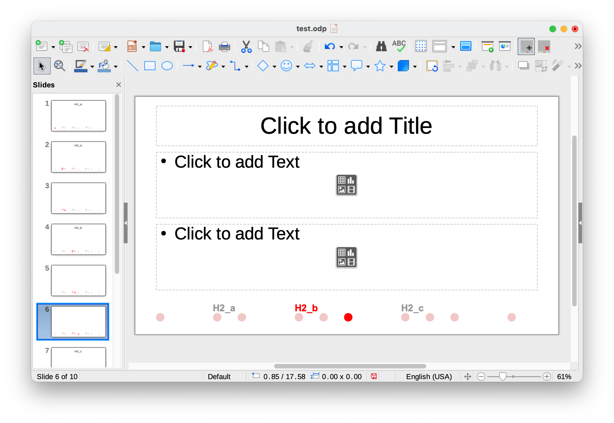
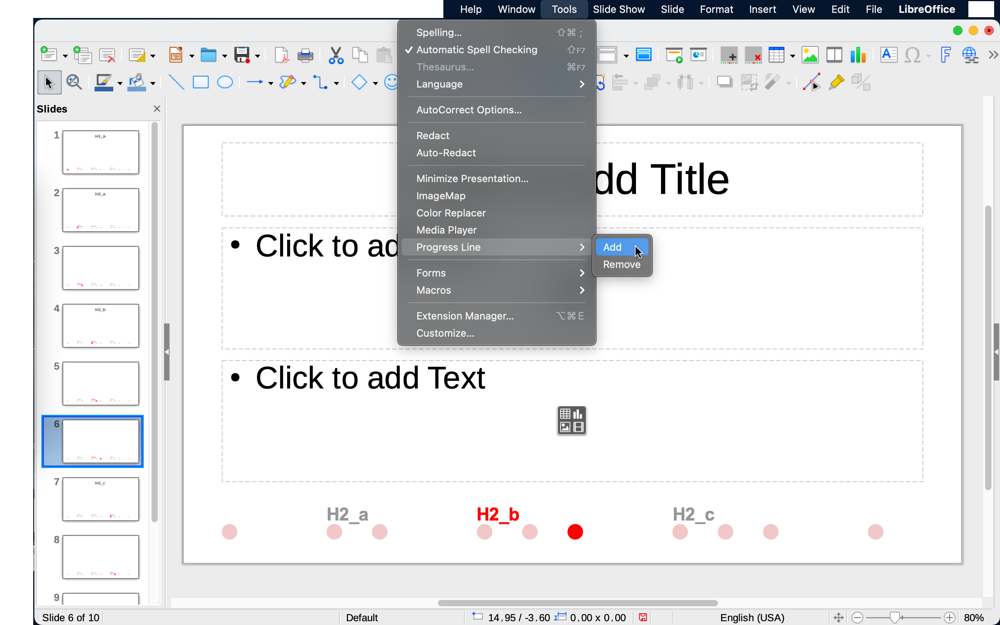

# Progress Line
**(impress-progress-line)**

Progress Line for LibreOffice/OpenOffice Impress presentations. It builds and adds very simple outline with progress indicator into existing slides, from a custom TOC file.

It uses a separate TOC from specific `<file.ext>.index` file to give authors full control on what should be shown and ability to shorten long titles.

Other customization possible: shape/color/font/format/margin are declared at the top of the script, any user with basic knowledge of Basic can tweak it.

## Install

1. Go to [extensions.libreoffice.org: progress-line](https://extensions.libreoffice.org/en/extensions/show/progress-line)
1. Downlaod last release and open it with LO/AOO.

## Add

1. Create index, a text file, in same folder with same name but with `.index` extension, (double extension) example `test.odp.index`:

        5
        1,_
        2,H2_a
        4,H2_b
        7,H2_c
        10,_

   - First line is total number of section
   - Remaining lines in this format: page, section title
   - `_` special for section without title

1. Open your presentation
1. Tools > Progress Line > Add (Available also on toolbar )

## Remove

- Tools > Progress Line > Remove (Available also on toolbar )

## Manual setup and alternative workflow

### Setup

1. Tools > Macros > Organize Macros > LibreOffice Basic...
1. My Macros: Create new Library "ProgressLineLibrary"
2. Then create new Module name it "ProgressLineModule" or whatever.
1. Select it then Edit, Copy contents of [src/ProgressLine.bas](src/ProgressLine.bas) or just import it.
1. Save it

### Add

1. Create `<file.ext>.index` file
1. Open your presentation
1. Tools > Macros > Organize Macros > LibreOffice Basic...: Run `ProgressLineAdd`

### Remove

- Tools > Macros > Organize Macros > LibreOffice Basic...: Run `ProgressLineRemove`

## Screenshots

